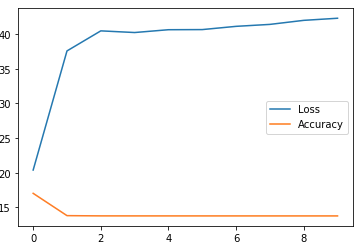
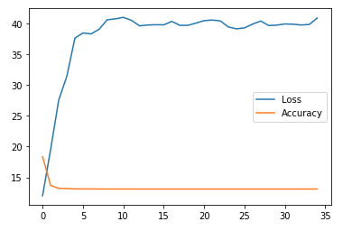
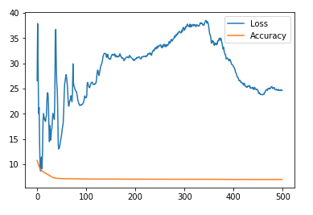
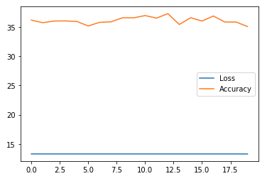

# msds19052_Project_DLSpring2020
This repository contains code and results for the Course Project by Deep Learning Spring 2020 course offered at Information Technology University, Lahore, Pakistan. This repository is only for learning purposes and is not intended to be used for commercial purposes.

# Training Accuracies

# Validation Accuracy

